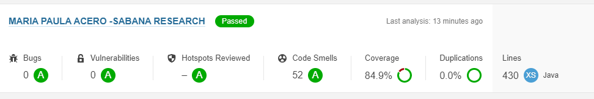

# BONUS 2
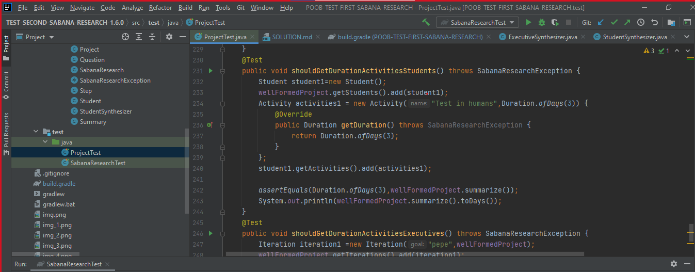
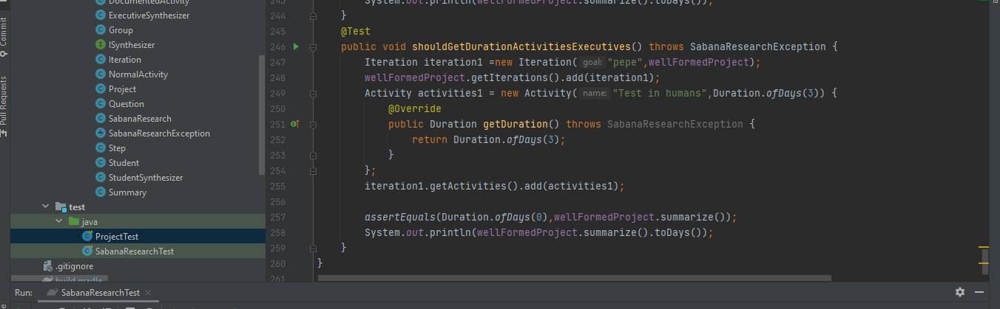
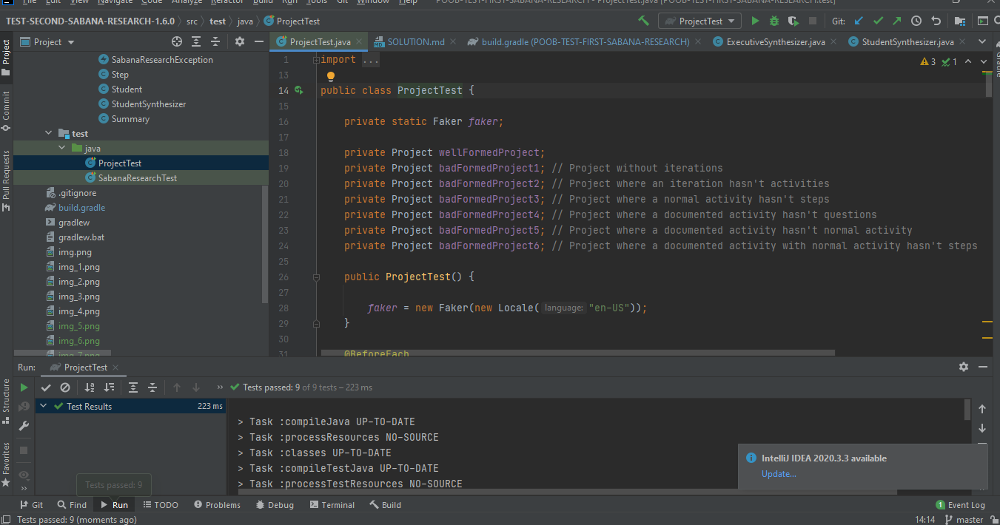

# BONUS 1
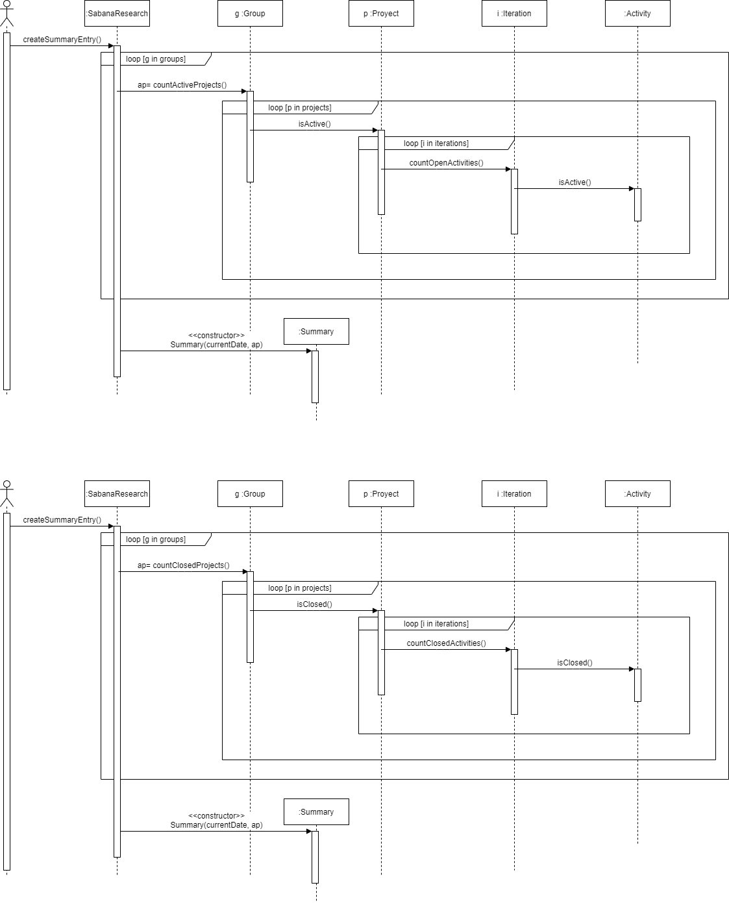
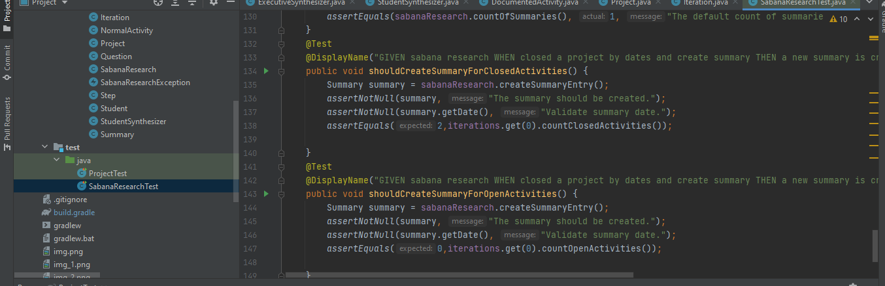
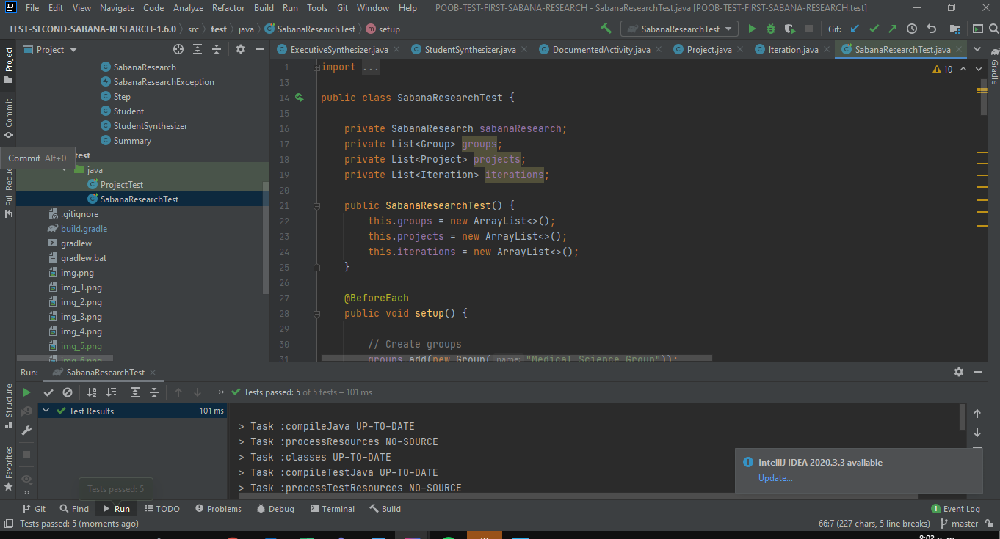

# CORRECCIÓN IMPLEMENTACIÓN DE LOS PARCIALES 
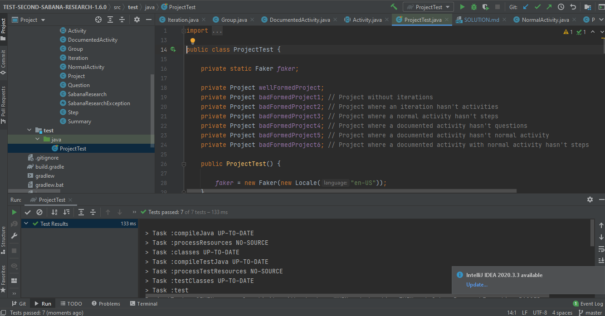
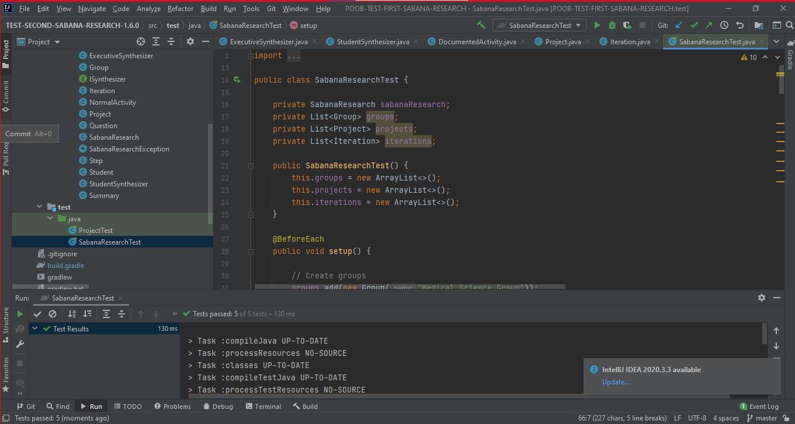

# DISEÑO PRIMER PARCIAL
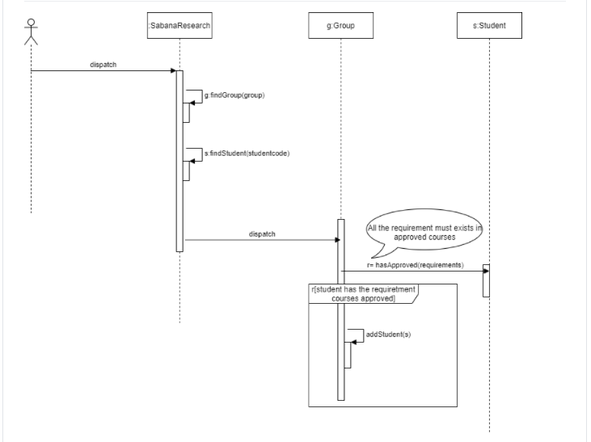

#DISEÑO Y EXTENDIENDO SEGUNDO PARCIAL 
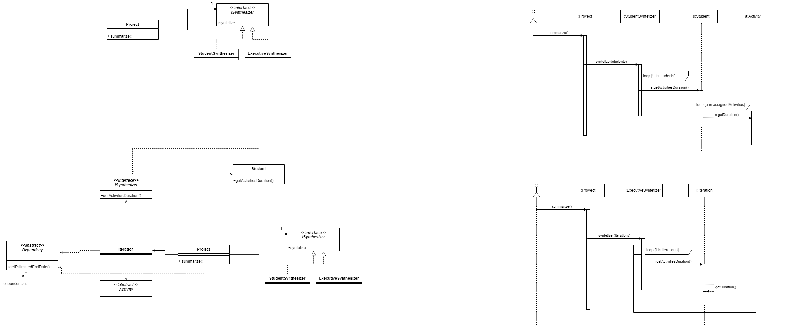

# CODIGO
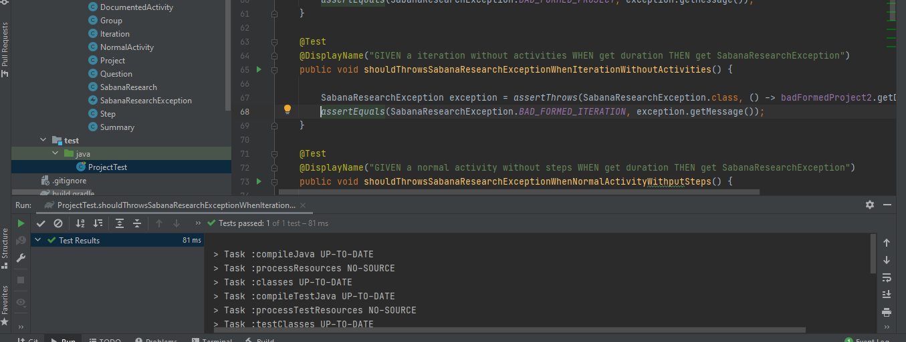

# EXTENDIENDO
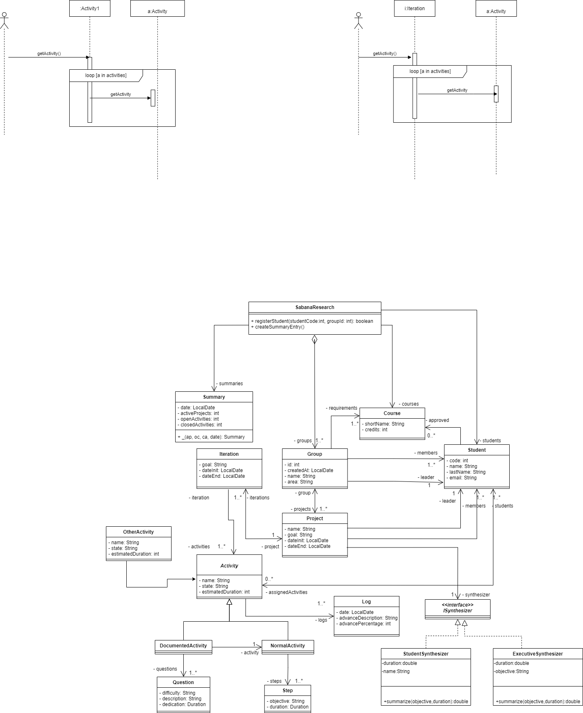

Al ser la actividad dependiente de una iteración y otra actividad, ya no tendría sentido que esta clase fuera abstracta por lo que dejaría de serlo y pasaría a depender de las clases antes mencionadas.

Lo malo es que al antes tener una clase abstracta esta ya tenía una funcionalidad común con las clases iteración y con otras posibles actividades

# DISEÑANDO

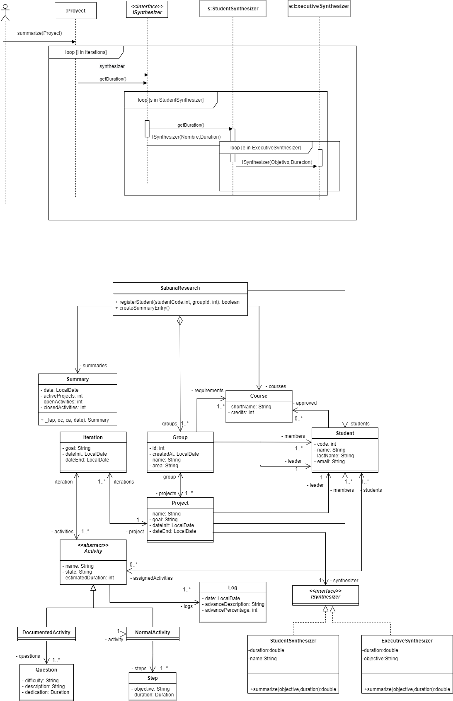

# CONCEPTOS

## ¿Cuáles son las acciones los tres momentos importantes de las excepciones? ¿Cuál es el objetivo de cada una? ¿Cómo se implementa en Java cada acción?.
Los tres momentos de las excepciones son:
1.En la que las lanzamos (Trow):

En este primer momento se lanza la excepción por lo que ahí se rompe el código es decir para de ejecutarse el código para informar que algo ocurrió por lo que lanza una excepción.
throw new palabra reservada

2.propagar (Propagate):

En este segundo momento hay un método que sabe que pude surgir una excepción que sale pero no tiene el conocimiento ni la responsabilidad para controlar la excepción.

3.Capturar (Catch)

En este último momento se hace responsable de ese error
Estructura de control : Try y catch y finally

-Try: intentar ejecutar un método un código, todos los métodos o potencialmente puede ejecutar  arrojar una excepción
-Catch: si la ejecución del método try lanza una excepción del tipo que quiero capturar ese código se va a ejecutar dentro del catch.
-Finally se ejecuta siempre así halla la expresión ocurra o no ocurra.

## ¿Qué es sobre-escritura de métodos? ¿Cómo impedir que se sobre-escriba un método?.

La sobreescritura de métodos es la forma en la que podemos cambiar o redefinir los métodos que ha heredado una clase de su clase padre, permitiéndonos crear métodos con el mismo nombre de la clase base.

¿Por qué aplicarla?

La aplicamos para que un método sea mas especifico a lo que queremos realizar y extender su funcionalidad, es decir si quiero que un determinado método me permita hacer algo en concreto para una clase hija tendría que sobrescribirlo de lo contrario tendría que hacerlo en la clase padre, lo cual se modificaría para todas las demás clases que estén heredando de dicha clase padre.

¿Cómo impedir que se sobre-escriba un método?.impedir que se sobre-escriba un método?.

la palabra reservada final es lo que evita que se pueda sobreescribir un método.